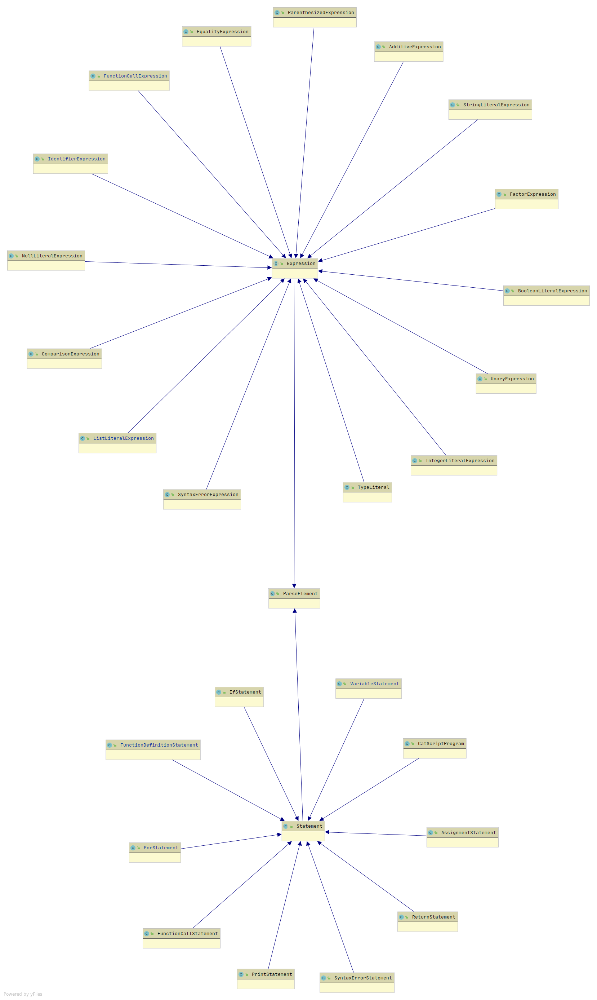

# CSCI Compilers 468 Spring 2021
## Kade Pitsch And Robert Jenko

## Sections
* ### [Source](#section-one)
* ### [Teamwork](#section-two-teamwork)
* ### [Design Patterns](#section-three-design-pattern)
* ### [Technical Writing](#section-four-technical-writing)
* ### [UML](#section-five-uml)
* ### [Design trade-offs](#section-six-design-trade-offs)
* ### [Software Dev. Cycle](#section-seven-software-development-life-cycle-model)


# Section One: Source
The source is contained in `source.zip` that is in this directory
# Section Two: Teamwork
For this course i was the main contributor for this project.This includes the code for 
tokenization, parsing, evaluation and byte-code. My partner {team-member 2} was responsible for 
providing documentation and 3 tests for my code base. This includes providing well structured
and concise documentation for my code. Also my partner {team-member 2} will write 3 tests for
my code that could written for tokenization, evaluation and/or byte-code. These test will be expected 
to be unique and run able with my current code. Team member contributions were 50/50 as we both
provided the same things to each other and i would
assume that we spent about two to four hours on each others
projects.  

## Tests that i provided to my partner
```java
//Test One
public void tokenTests() {
    assertTokensAre("12 - 1 + 1", INTEGER, MINUS, INTEGER, PLUS);
    assertTokensAre("return false return true", RETURN, FALSE, RETURN, TRUE);
    assertTokensAre("({[]})", LEFT_PAREN, LEFT_BRACE, LEFT_BRACKET, RIGHT_BRACKET, RIGHT_BRACE, RIGHT_PAREN);
}
//Test Two
public void parsingTest() {
    VariableStatement expr = parseStatement("var cat : string = "meow"");
    assertNotNull(expr);
    assertEquals("cat", expr.getVariableName());
    assertEquals(CatscriptType.BOOLEAN, expr.getExplicitType());
    assertTrue(expr.getExpression() instanceof StringLiteralExpression);
}

//Test 3
public void evalTests() {
    assertEquals(true, evaluateExpression("2 < 4"));
    assertEquals(false, evaluateExpression("2 > 4"));
    assertEquals(true, evaluateExpression("true == true"));
    assertEquals(1, evaluateExpression("1"));
}
```


## Documentation From Partner {Team-member 2}

# Section Three: Design Pattern
Memoize type access is a type of optimization pattern.
This is where we store the results of expensive function calls and then the next time that a program requests
that function we already have it stored instead of re-computing everything all over again.
In catscript we did it like this
``` java
static Map<CatscriptType, CatscriptType> CACHE = new HashMap<>();
public static CatscriptType getListType(CatscriptType type) {
    CatscriptType possibleMatch = CACHE.get(type);
    if(possibleMatch != null){
        return possibleMatch;
    } else {
        ListType listType = new ListType(type);
        CACHE.put(type, listType);
        return listType;
    }
}
```
This function will store that said function and we treat it as a `CACHE` when this function is called if the function already exists in the 
list then great just return it, otherwise we need to make a 'copy' of that function call and put it into the list.
Now we have a very simple memoization of functions. 

# Section Four: Technical Writing
## Tokenization
Tokenization is where our recursive descent parsing starts. Starting with the `tokenize()` function,
consuming whitespace that does not matter for catscript.
``` java
    private void tokenize() {
        consumeWhitespace();
        while (!tokenizationEnd()) {
            scanToken();
            consumeWhitespace();
        }
        tokenList.addToken(EOF, "<EOF>", position, position, line, lineOffset);
    }
```
`tokenize()` then calls `scanToken()` which will associate a type wih our token.


``` java
    private void scanToken() {
        if (scanNumber()) {
            return;
        }
        if (scanString()) {
            return;
        }
        if (scanIdentifier()) {
            return;
        }
        scanSyntax();
    }
```
scanning the tokens until an associated type is returned. This is how the recursive descent parsing will work throughout
the rest of the compiler.

Each of these types have associated functions that are further parse the token. For example if we encounter a string we will
first verify that we are actually trying to parse a string. I am just going to pick apart one of these functions so we can 
see what is going on 
``` java
    private boolean scanString() {
        boolean endquote = true;
/*1*/   if (peek() == '"') {
            takeChar();
/*2*/       int start = position;
            while (!tokenizationEnd()) {
                if (peek() == '"') {
/*3*/               String value = src.substring(start, position);
/*4*/               tokenList.addToken(STRING, value, start, position, line, lineOffset);
                    takeChar();
                    return true;
                }
/*5*/           if (peek() == '\\') {
                    takeChar();
                    if (peek() == '"') {
                        takeChar();
                    }
                }

/*6*/           if (tokenizationEnd()) {
                    tokenList.addToken(ERROR, "No closing String", start, position, line, lineOffset);
                    return true;
                }
                takeChar();
            }
/*7*/       tokenList.addToken(ERROR, "No closing String", start, position, line, lineOffset);
            return true;
        }
        return false;
    }
```
`scanString()` returns a boolean after parsing and tokenizing our string. We start at `/*1*/` checking for sure that we are looking
at a string. A Catscript string is java style string so defined by two double quotes enclosing something.
Once we know that we are scanning s string the `"` is consumed and we continue with the tokenization process.
We need to know how the position of where we started s on `/*2*/` we specify where we started reading. Then we start reading the string 
until we reach the end of the string specified by another unescaped `"` character. `/*3*/` is where we actually take the full position 
of the string and set it equal to a Java string. Then on `/*4*/` we tell our Catscript parser what out string token is.
`/*5*/` is what happens if we encounter a comment in Catscript which is then treated as a string. The same process is carried out.
`/*6*/ & /*7*/` are some basic error handlers. If we encounter the tokenization end before we actually close the string with a `"`
There are 2 other tokenization options for if we encounter a number or an Identifier, they follow the same form.
The other one that is super important to the compiler is the `scanSyntax()` function. It is a really big one so i will
just clip some of the more interesting ones and explain.

``` java
else if (matchAndConsume('=')) {
            if (matchAndConsume('=')) {
                tokenList.addToken(EQUAL_EQUAL, "==", start, position, line, lineOffset);
            } else {
                tokenList.addToken(EQUAL, "=", start, position, line, lineOffset);
            }

        }
```
Here we have our equality operator token which triggers when we match an `=` sign which tells us we are doing some equal or equality operation
if we just have a `=` then we are setting something equal to something else. Otherwise read another `=` and we have the equality operator `==` which
is going to return a boolean but that will be handled in our parser.

``` java
 else if (matchAndConsume('/')) {
            if (matchAndConsume('/')) {
                while (peek() != '\n' && !tokenizationEnd()) {
                    takeChar();
                }
            } else {
                tokenList.addToken(SLASH, "/", start, position, line, lineOffset);
            }
        }

```
This is where we are handling the comments in Catscript. If we have a `/` consume it, do we have another one? Consume it and read until we hit 
`tokenizationEnd()` or a `\n` character. If only one slash then just add that token.

I think this covers the fundamentals of what is happening in the tokenization step. There are some important helper functions like 
`matchAndConsume()` but we did not write those so we will just leave them at that, helper functions.

## Parsing
Parsing is huge compared to Tokenization so i will go over the functions that i *Team Member 2* think 
* Are the most important
* Encapsulate the fundamentals of parsing in catscript.

``` java
    private Statement parseStatement() {
        if (tokens.match(FUNCTION)) {
            return parseFunction();
        } else if (tokens.match(FOR)) {
            return parseFor();
        } else if (tokens.match(PRINT)) {
            return parsePrint();
        } else if (tokens.match(VAR)) {
            return parseVar();
        } else if (tokens.match(IF)) {
            return parseIf();
        } else if (tokens.match(RETURN)) {
            return parseReturn();
        } else if (tokens.match(IDENTIFIER)) {
            Token token = tokens.consumeToken();
            if (tokens.matchAndConsume(LEFT_PAREN)) {
                FunctionCallExpression exp = (FunctionCallExpression) parseFunctionCall(token);
                return new FunctionCallStatement(exp);
            }
            return parseAssignment(token);
        } else if (tokens.match(EQUAL)) {
            return parseAssignment(tokens.getCurrentToken());
        } else {
            return new SyntaxErrorStatement(tokens.consumeToken());
        }
    }
```
This is the most important function in the parser. This function will parse out which type we are working with... descending into more specificity.

The `parseFunction()` method is the second most important method for parsing. 
This is the form of a function in our Catscript grammar
``` ebnf
function_declaration = 'function', IDENTIFIER, '(', parameter_list, ')' + 
                       [ ':' + type_expression ], '{',  { function_body_statement },  '}';

function_body_statement = statement |
                          return_statement;
function_call_statement = function_call;
function_call = IDENTIFIER, '(', argument_list , ')'
```

Which reads as we declare a function in catscript as `function foo(x:int) : int {}` where we have the identifier `function` then the 
function name and args `foo(x : int)` finally the return type `int` with the curly braces that will contain the function body. 
`/*1*/` we have a similar approach to the string scanning we did in tokenization. We need to know where the start of the function is so we can 
properly parse it. `/*2*/` After we consume the whole function token we set the name of the function from the string value of that function.
`/*3*/` We then need a list to store all the function arguments into, this will make it easiest for us to evaluate these. 
Which happens directly below `/*3*/` we are looping through all the statements inside that list and adding them to 
out parameters.
Once we have added all the types and parameters to the function then we get the function body which has a whole other function to process that
on line `/*5*/`


``` java
    private Statement parseFunction() {
        FunctionDefinitionStatement funcDefinition = new FunctionDefinitionStatement();
/*1*/   funcDefinition.setStart(tokens.consumeToken());
        Token function = tokens.consumeToken();
/*2*/   funcDefinition.setName(function.getStringValue());
        require(LEFT_PAREN, funcDefinition);
/*3*/   List<Parameter> listOfStatements = paramList();
        for (Parameter stmt : listOfStatements) {
            funcDefinition.addParameter(stmt.getIdentifier(), stmt.getType());
        }
        require(RIGHT_PAREN, funcDefinition);
        if (tokens.matchAndConsume(COLON)) {
            funcDefinition.setType(parseTypeExpression());
        } else {
            TypeLiteral voidType = new TypeLiteral();
            voidType.setType(CatscriptType.VOID);
            funcDefinition.setType(voidType);
        }
        require(LEFT_BRACE, funcDefinition);
        currentFunctionDefinition = funcDefinition;
/*5*/   funcDefinition.setBody(parseFunctionBody());
        require(RIGHT_BRACE, funcDefinition);
        funcDefinition.setEnd(tokens.lastToken());

        currentFunctionDefinition = funcDefinition;
        return funcDefinition;
    }

```

# Section Five: UML
Here we have the expressions in UML form. We can se that the top of the image all expression types have an IS-A relationship with the base expression in the center.
`EqualityExpression` IS A type of `Expression`
Expression is also a type of `ParseElement`
Then we also have Statements on the bottom 'balloon'. This all have a IS A relationship to the base class `Statement`
`IfStatement` IS A `Statement` and `Statement` is a `ParseElement`



This is another example of our recursive descent compilation method. After we get to the `ParseElement`
is it an expression or is it a statement? Then we can define a more specific method down the tree.
nb 


# Section Six: Design trade-offs
The main design trade-off in this class was based on Recursive Descent vs Parser Generator. 
A recursive descent parser is a top down parser that relies on recursive procedures.
While a parser generator takes CFG or a set of rules to then create a parser. 
Recursive descent has many benefits to a parser generator, one being that when working with recursive descent it
is very easy to see and understand how parsing is fundamentally working while as parser generators are more difficult to understand 
but can be quicker to implement. To me this trade-off is more than worth it because i feel like i actually learned something about
parsing through recursive descent. Parser generators can be cumbersome and tedious to implement other features into as well.
I do believe that recursive descent taught me more and helped me understand how the compiler was working at every step and i do not think that
i would have gotten that same feeling if we had implemented a parser generator.

# Section Seven: Software development life cycle model
For this class we used the test-driven development for our software lifecycle. This type of development where
you write test cases to 'test' your software. For our programs this was super nice because we could just write
code and continually test it. Writing least amount of code until we were able to get the test passing
then we could refactor if we needed to or just move onto the next tests.
For me i had a lot of fun writing software this way because it made
it interactive and kinda like a game. Just getting more and more tests to pass was a lot of fun and a really
nice way to stay on track. I know that is not how it probably works in the industry because those tests are not
going to be pre-written for you so i assume that it was not TDD by the book but close enough for us.
